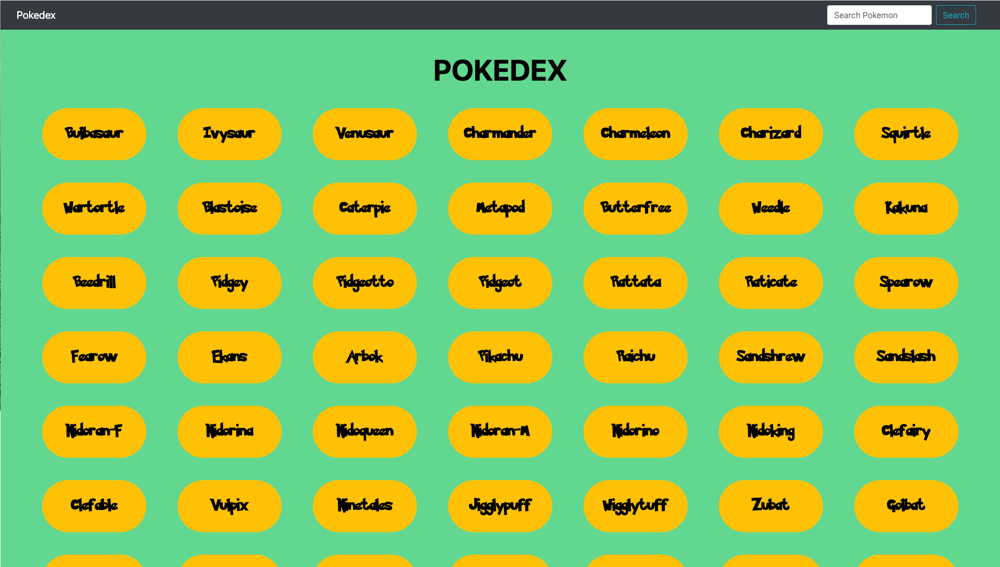

# simple-js-app
 

 <h1> My Pokedex App!</h1>
 
 This App uses an external API to load data and display a list of pokemons and their details. I worked on this project while learning JavaScript for the first time.  

  
 
 <ul align="center">Built with:
 <li>HTML</li>
 <li>CSS</li>
 <li>JavaScript</li>
 <li>jQuery</li>
 <li>Bootstrap</li>
 </ul>

 <h3>Screenshot</h3>

 
 
 

